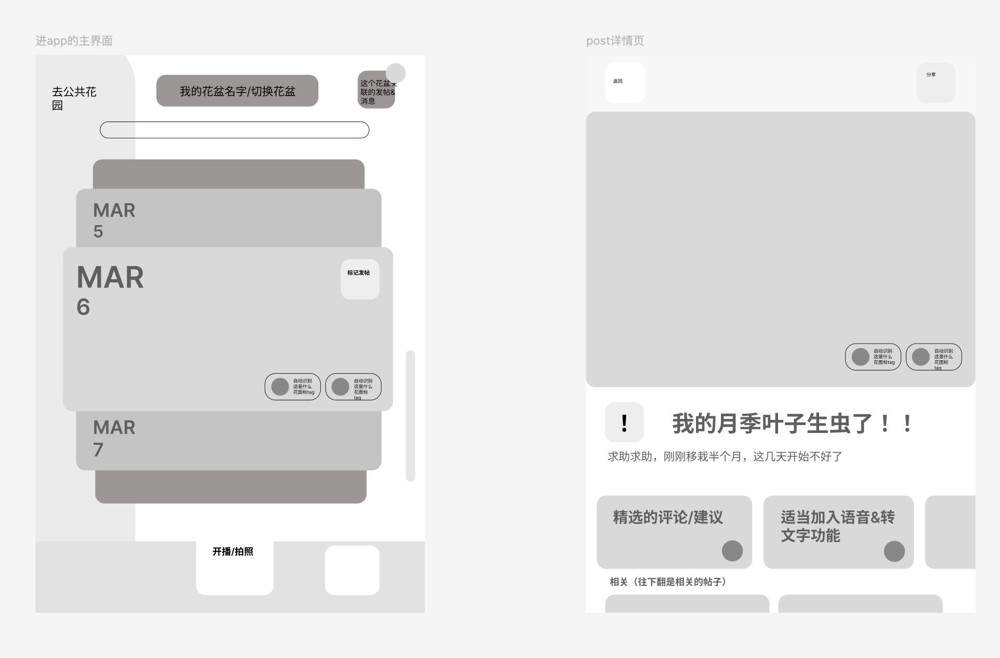
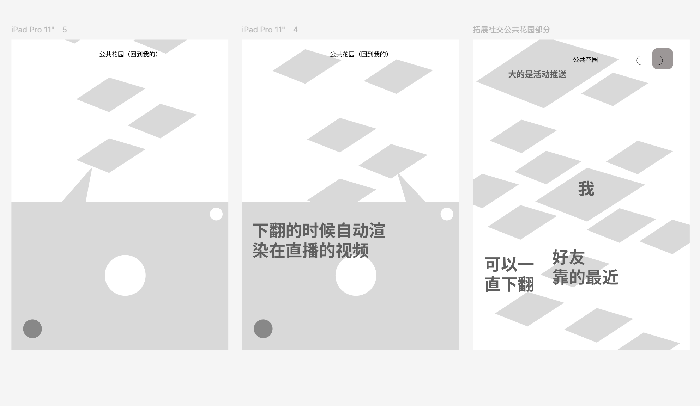
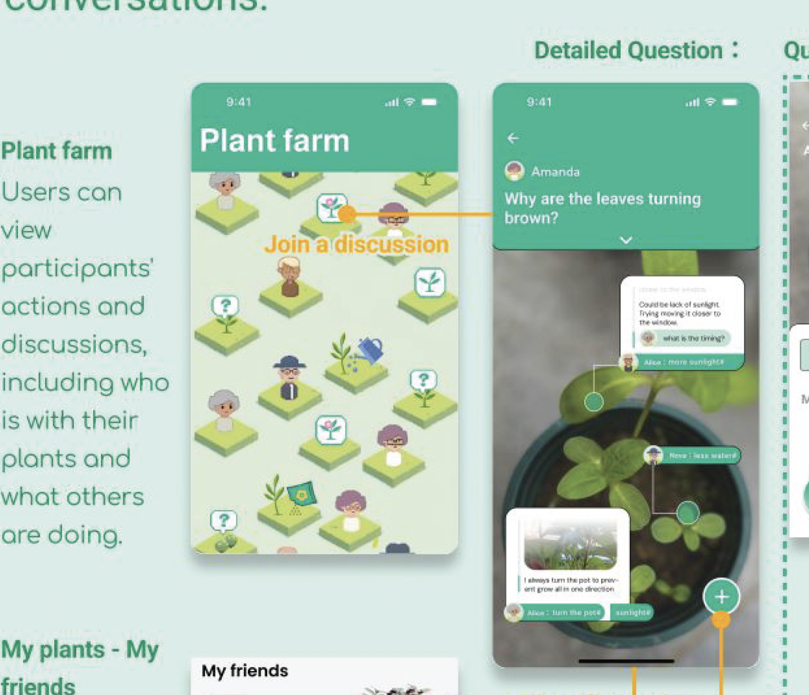

# ARCHITECTURE.md — GardenLink

## 1. Product Vision

GardenLink is a mobile-first web platform that helps older adults stay socially connected through gardening. Instead of asking users to "post" like a traditional forum, the platform centers on **passive visibility** — a live camera or photo timeline of your garden that others can browse, react to, and discuss around. Social interaction emerges naturally from plants growing, blooming, and needing help, rather than from users crafting posts.
Project insights, early-stage user research, and design direction are drawn from Fan Zhang's prior work on GardenLink — see the [GardenLink Portfolio (Fan Zhang)](./assets/GardenLink.pdf) for more details.

### Core Insight (from user research)

- Older adults share more freely in small, familiar circles — not public forums.
- Sharing motivation is **event-driven**: something bloomed, something's wrong, something's ready to harvest.
- "Watching what others are doing" is itself enough to spark participation.
- The biggest barrier is the **effort of posting** — typing, composing, organizing thoughts.

### Design Principles

1. **Zero-effort visibility**: Your garden is always "on." You don't post — your plants speak for you.
2. **Shallow interaction hierarchy**: Two taps max to do anything meaningful.
3. **Local-first, interest-extended**: Start with your physical neighborhood, expand via shared plant species.
4. **Event-driven engagement**: The platform surfaces moments (bloom, harvest, trouble) — not empty feeds.

---

## 2. Information Architecture

The app has a **flat two-tab structure** — no deep navigation, no settings buried in menus.

```
┌─────────────────────────────────────────────────────────┐
│                     GardenLink App                       │
│                                                          │
│   ┌─────────────────────┐   ┌─────────────────────────┐ │
│   │   🌱 My Garden      │   │   🏡 Public Garden       │ │
│   │   (Primary Tab)     │   │   (Secondary Tab)        │ │
│   └─────────┬───────────┘   └──────────┬──────────────┘ │
│             │                          │                 │
│             ▼                          ▼                 │
│   ┌─────────────────┐       ┌──────────────────────┐    │
│   │ Photo Timeline  │       │ Nearby Gardens Grid  │    │
│   │ (calendar gallery│       │ (cards w/ live       │    │
│   │  of my plants)  │       │  thumbnails)         │    │
│   │                 │       │                      │    │
│   │ • Auto-organized│       │ • Activity cards     │    │
│   │   by date       │       │   (someone's live,   │    │
│   │ • Tap to expand │       │    new highlight,    │    │
│   │ • "Mark & Post" │       │    help request)     │    │
│   │   from any photo│       │                      │    │
│   │ • Start live /  │       │ • Community Events   │    │
│   │   take photo    │       │   (seed pickup,      │    │
│   └────────┬────────┘       │    group planting)   │    │
│            │                └──────────┬───────────┘    │
│            ▼                           ▼                │
│   ┌─────────────────┐       ┌──────────────────────┐   │
│   │ My Posts &      │       │ Garden Detail Page   │   │
│   │ Messages        │       │ (someone else's      │   │
│   │ (sent highlights│       │  timeline + their    │   │
│   │  help requests, │       │  highlights)         │   │
│   │  replies to me) │       │                      │   │
│   └─────────────────┘       └──────────────────────┘   │
│                                                         │
│   ┌─────────────────────────────────────────────────┐   │
│   │              Post Detail Page                    │   │
│   │  (Shared by both tabs)                           │   │
│   │                                                  │   │
│   │  • Full photo(s) with AI-detected plant tags     │   │
│   │  • If "help": before/after timeline from gallery │   │
│   │  • Comments / suggestions (text + voice-to-text) │   │
│   │  • AI-generated beginner advice                  │   │
│   │  • Related posts from similar species growers    │   │
│   └─────────────────────────────────────────────────┘   │
└─────────────────────────────────────────────────────────┘
```



### low-fi Sketches Breakdown




#### Tab 1: My Garden (Home)

- **Top bar**: Garden name / switch between gardens (if user has multiple pots) + notification badge for replies
- **Main area**: Calendar-based photo timeline (gallery). Each day shows thumbnails. Scroll is vertical by date. Tap a photo to expand.
- **On any photo**: "Mark & Post" button — creates a Highlight (bloom/harvest) or Help Request directly from the existing photo, no need to re-upload.
- **Bottom bar**: "Go Live / Take Photo" — opens camera. Live mode does a short session (auto-saves ~15s highlight snapshots). Photo mode adds to today's timeline.
- **Secondary access**: "My Posts & Messages" — flat list of highlights/help-requests the user has created, plus replies received.

#### Tab 2: Public Garden

- **Default view**: Grid of nearby gardens (cards). Each card = garden name + latest photo + status indicator (🔴 live, 🌸 new highlight, ❓ needs help).
- **Scroll behavior**: Cards at top. Below the fold, larger featured cards for **community events** (seed distribution, group planting activities).
- **Toggle**: "Public Garden / Me" — switch between browsing community and a centered view showing "me" surrounded by friends/nearest gardens.
- **Tap a card** → Garden Detail Page (that person's timeline + their highlights).
- **Live video behavior**: Streams show as static thumbnails by default. Autoplay only when user scrolls to or taps the card, to avoid visual overwhelm.

#### Post Detail Page (shared)

- Hero: the photo(s)
- AI-detected tags (plant species, growth stage, garden zone) shown as chips
- If help request: auto-assembled before/after strip from the timeline
- Comments section with voice-to-text option
- AI suggestion card (collapsible)
- "Related" section: posts from people growing the same species

### Navigation Flow

```
My Garden ──→ Photo Timeline ──→ Mark & Post ──→ Post Detail
    │                                                ↑
    └──→ My Posts & Messages ────────────────────────┘
                                                     ↑
Public Garden ──→ Garden Card ──→ Garden Detail ─────┘
    │
    └──→ Community Event Detail
```

Maximum depth from any tab: **3 taps**. Most actions: **1-2 taps**.

---

## 3. System Architecture

### C4 — System Context

```
┌──────────┐         ┌─────────────────────────────────┐
│  Elderly │ ──────> │        GardenLink Web App        │
│   User   │ <────── │     (Mobile-first PWA)           │
│ (Phone/  │         └──────┬──────────┬────────────────┘
│  Tablet) │                │          │
└──────────┘                ▼          ▼
                     ┌──────────┐ ┌──────────┐
                     │ Supabase │ │ AI API   │
                     │ (DB,Auth,│ │ (TBD -   │
                     │  Storage,│ │  Vision +│
                     │  Realtime│ │  Text)   │
                     └──────────┘ └──────────┘
```

### C4 — Container Diagram

```
┌──────────────────────────────────────────────────────────┐
│                     GardenLink                            │
│                                                           │
│  ┌─────────────────────────────────────────────────────┐  │
│  │              Next.js 14 (App Router)                 │  │
│  │                                                      │  │
│  │  /                 → My Garden (photo timeline)      │  │
│  │  /public           → Public Garden (nearby grid)     │  │
│  │  /garden/[id]      → Someone else's garden detail    │  │
│  │  /post/[id]        → Post detail (highlight / help)  │  │
│  │  /event/[id]       → Community event detail          │  │
│  │  /me               → My posts & messages             │  │
│  │                                                      │  │
│  │  /api/ai/tags      → AI plant recognition            │  │
│  │  /api/ai/advice    → AI gardening advice             │  │
│  │  /api/ai/related   → Find similar species growers    │  │
│  └──────────┬──────────────────────┬────────────────────┘  │
│             │                      │                       │
│             ▼                      ▼                       │
│  ┌────────────────────┐  ┌─────────────────────┐          │
│  │    Supabase         │  │    AI API (TBD)       │          │
│  │                     │  │                      │          │
│  │  • PostgreSQL (DB)  │  │  • Vision model      │          │
│  │  • Auth             │  │    (plant ID, tags)   │          │
│  │  • Storage (images) │  │  • Text model         │          │
│  │  • Realtime (live   │  │    (advice, matching) │          │
│  │    status updates)  │  │                      │          │
│  └────────────────────┘  └─────────────────────┘          │
└──────────────────────────────────────────────────────────┘
```

---

## 4. Data Model

Six tables. Supabase Auth handles user identity.

### `profiles`

Extends Supabase auth.users with display info.

| Column       | Type         | Notes                                |
|-------------|-------------|---------------------------------------|
| id          | uuid (PK/FK) | References auth.users.id             |
| display_name| text         | Shown in community                   |
| avatar_url  | text?        | Profile picture                      |
| location    | text?        | Neighborhood / community name        |
| lat         | float?       | For "nearby" sorting                 |
| lng         | float?       | For "nearby" sorting                 |
| created_at  | timestamptz  |                                      |

### `gardens`

Each user can have one or more gardens (pots, plots, balconies).

| Column       | Type         | Notes                                |
|-------------|-------------|---------------------------------------|
| id          | uuid (PK)    |                                      |
| owner_id    | uuid (FK)    | References profiles.id               |
| name        | text         | e.g. "Balcony roses" / "Community plot #3"  |
| description | text?        |                                      |
| is_live     | boolean      | Currently streaming / active         |
| created_at  | timestamptz  |                                      |

### `photos`

The core content unit. Every image goes here first, organized by garden + date.

| Column       | Type         | Notes                                |
|-------------|-------------|---------------------------------------|
| id          | uuid (PK)    |                                      |
| garden_id   | uuid (FK)    | References gardens.id                |
| image_url   | text         | Supabase Storage URL                 |
| thumb_url   | text         | Compressed thumbnail                 |
| taken_at    | timestamptz  | When the photo was taken             |
| ai_tags     | text[]       | AI-detected: ["rose", "blooming", "healthy"] |
| source      | text         | "camera" / "live_snapshot" / "upload"|
| created_at  | timestamptz  |                                      |

### `posts`

Created by "marking" a photo. A post is always attached to one or more photos.

| Column       | Type         | Notes                                |
|-------------|-------------|---------------------------------------|
| id          | uuid (PK)    |                                      |
| garden_id   | uuid (FK)    | References gardens.id                |
| author_id   | uuid (FK)    | References profiles.id               |
| post_type   | text         | "highlight" / "help"                 |
| title       | text         | Short description                    |
| body        | text?        | Optional longer text                 |
| photo_ids   | uuid[]       | References to photos used            |
| ai_advice   | text?        | AI-generated response (for help)     |
| created_at  | timestamptz  |                                      |

### `comments`

Replies on posts. Supports voice-to-text.

| Column       | Type         | Notes                                |
|-------------|-------------|---------------------------------------|
| id          | uuid (PK)    |                                      |
| post_id     | uuid (FK)    | References posts.id                  |
| author_id   | uuid (FK)    | References profiles.id               |
| body        | text         | Comment text                         |
| is_voice    | boolean      | Was this voice-to-text input?        |
| created_at  | timestamptz  |                                      |

### `events`

Community activities (seed distribution, group planting).

| Column       | Type         | Notes                                |
|-------------|-------------|---------------------------------------|
| id          | uuid (PK)    |                                      |
| title       | text         | e.g. "Spring rose cutting exchange"    |
| description | text         |                                      |
| image_url   | text?        |                                      |
| location    | text         | Pickup / meetup location             |
| event_date  | timestamptz  |                                      |
| created_at  | timestamptz  |                                      |

### RLS Policies (summary)

- Everyone can read all gardens, photos, posts, comments, events.
- Users can only insert/update/delete their own gardens, photos, posts, comments.
- Events are admin-created (or open to all — TBD with client).

### ER Diagram

```
profiles 1──* gardens 1──* photos
                │
                └──* posts *──* photos (via photo_ids)
                       │
                       └──* comments

events (standalone, community-wide)
```

---

## 5. Tech Stack

| Choice | Justification |
|--------|---------------|
| **Next.js 14 (App Router)** | Server components for fast initial loads on older/slower phones. API routes for AI calls. Easy Vercel deployment with preview URLs for PR review. |
| **Supabase** | Postgres + Auth + Storage + Realtime in one managed service. Free tier covers project needs. Realtime subscriptions enable live status indicators in Public Garden. |
| **Tailwind CSS** | Rapid mobile-first styling. Easy to enforce large fonts (18px+ base), high contrast, and 48px+ touch targets for elderly accessibility. |
| **AI Model (TBD)** | Model selection pending — requires rigorous comparison of candidates (OpenAI GPT-4o, Google Gemini, Anthropic Claude, open-source alternatives) on plant recognition accuracy, cost per call, latency, and multilingual support. A formal evaluation will be conducted in PR #7 before integration. |
| **Vercel** | Zero-config Next.js hosting. Preview deployments for every PR so client can test before merging. |

### Live Video Strategy

The architecture plans for real video streaming (camera feed of a garden). For the course demo, this will be **simulated with pre-recorded local video files** embedded in the UI. The interaction design (live indicator, snapshot saving, viewer reactions) will be fully functional around the simulated stream.

Production path (documented for completeness):
- WebRTC peer-to-peer for small-scale 1:few streams
- Or HLS via a service like Mux/Cloudflare Stream for broader distribution
- Auto-snapshot: server-side frame extraction at intervals during a live session

### Image Handling

Photos are the core asset. Pipeline:
1. User takes photo → client-side compression (browser `canvas` resize to max 1200px wide)
2. Upload to Supabase Storage → generates `image_url`
3. Edge Function or API route generates thumbnail (400px) → `thumb_url`
4. AI tagging runs async after upload → writes `ai_tags` to photos row
5. Public Garden grid always loads thumbnails first, full images on tap

---

## 6. AI Features

Three capabilities, all non-blocking (the app works fine without them).

### AI Model Selection (pending evaluation)

The specific AI model(s) have not yet been chosen. Before integration (PR #7), we will conduct a structured comparison across these dimensions:

- **Plant recognition accuracy**: Test each candidate with 30+ photos of common garden plants at various growth stages and health conditions. Measure species identification accuracy and health assessment quality.
- **Cost per call**: Compare pricing for both vision and text inference at projected usage volumes.
- **Latency**: Measure response time for photo tagging (must feel near-instant) vs. advice generation (can tolerate a few seconds).
- **Multilingual support**: Evaluate quality of responses for a multilingual elderly audience.

Candidates to evaluate: OpenAI GPT-4o / 4o-mini, Google Gemini Flash / Pro, Anthropic Claude Sonnet / Haiku, and potentially open-source vision models (e.g. LLaVA) for cost-sensitive features like auto-tagging.

The architecture is model-agnostic — all AI calls go through internal API routes (`/api/ai/*`) so swapping providers requires changing only the route implementation, not the frontend.

### 6.1 Auto-tagging (Plant Recognition)

- **Trigger**: After photo upload
- **Input**: Photo sent to vision-capable AI model (TBD)
- **Output**: Plant species, growth stage, health status → stored as `ai_tags` on the photo
- **Use**: Powers "related posts" matching, species-based community grouping, and cross-neighborhood connections

### 6.2 Gardening Advice (Help Requests)

- **Trigger**: User creates a "help" post
- **Input**: The marked photo(s) + any text description + plant tags
- **Output**: Beginner-friendly diagnosis and care suggestions
- **Display**: Collapsible AI card on the post detail page, clearly labeled as AI-generated

### 6.3 Cross-Community Matching

- **Trigger**: Passive, runs periodically or on-demand
- **Logic**: Find other gardens/posts with matching `ai_tags` (same species) across different neighborhoods
- **Display**: "Related" section on post detail; "People growing the same plant" suggestions in Public Garden
- **Purpose**: Extends social connections beyond geographic proximity

---

## 7. Accessibility for Elderly Users

| Concern | Solution |
|---------|----------|
| Small text | 18px base font, 22px+ for headings, scalable |
| Low contrast | WCAG AA minimum, high-contrast default theme |
| Small buttons | All touch targets ≥ 48x48px |
| Complex navigation | Two-tab flat structure, max 3 taps to any action |
| Typing difficulty | Voice-to-text for comments, quick-react emoji buttons, "Mark & Post" from existing photos instead of composing |
| Slow network | Thumbnail-first loading, upload queue for poor connectivity |
| Video overwhelm | Live streams show as static thumbnails by default, autoplay only when tapped |

---

## 8. Agentic Engineering Plan

### AI Development Setup

- `CLAUDE.md` at repo root: project context, conventions, data model reference, component naming patterns
- `.cursorrules`: mirrors key constraints (mobile-first, accessibility rules, Supabase patterns)

### Development Workflow

1. Each GitHub Issue = one focused AI prompt context
2. AI generates implementation → I review for correctness, RLS security, accessibility, and mobile responsiveness
3. Each feature ships as a PR referencing its Issue
4. Client (Fan) reviews every PR before merge
5. Branch protection: `main` requires 1 approval

### Planned PR Sequence

| PR | Scope | Est. Hours |
|----|-------|-----------|
| #1 | ARCHITECTURE.md (this document) | 3 |
| #2 | Project scaffold: Next.js + Supabase + DB migration + auth + two-tab layout shell | 8 |
| #3 | My Garden: photo timeline gallery + camera/upload + date organization | 10 |
| #4 | Mark & Post: create highlights and help requests from photos | 8 |
| #5 | Public Garden: nearby gardens grid + garden detail page | 8 |
| #6 | Post Detail: comments, voice-to-text, AI advice, related posts | 8 |
| #7 | AI features: auto-tagging, species matching, cross-community recommendations | 6 |
| #8 | Live video simulation + community events + polish | 9 |

**Total estimated: ~60 hours**

### Progress Check-ins

| Checkpoint | Expected State |
|-----------|----------------|
| Gate 1 | Scaffold + My Garden timeline working. User can sign in, take/upload photos, browse by date. |
| Gate 2 | Mark & Post + Public Garden. Core social loop functional: post highlights, browse others' gardens. |
| Gate 3 | Full feature set including AI, live video simulation, community events. Ready for demo. |

---

## 9. Deployment

- **Hosting**: Vercel (free tier)
- **Database + Auth + Storage**: Supabase (free tier)
- **AI**: Model provider TBD (pay-per-use, minimal cost at demo scale)
- **CI**: GitHub Actions for lint + type-check on PRs
- **Preview**: Every PR gets a Vercel preview URL for client testing

---

## 10. Future Considerations (Out of Scope)

- Real camera/IoT integration (smart pot with auto-upload)
- True live streaming infrastructure (WebRTC/HLS)
- Push notifications (PWA push or native app)
- Seed/cutting exchange coordination
- Community group planting campaigns
- Aggregated bloom calendar across neighborhoods
